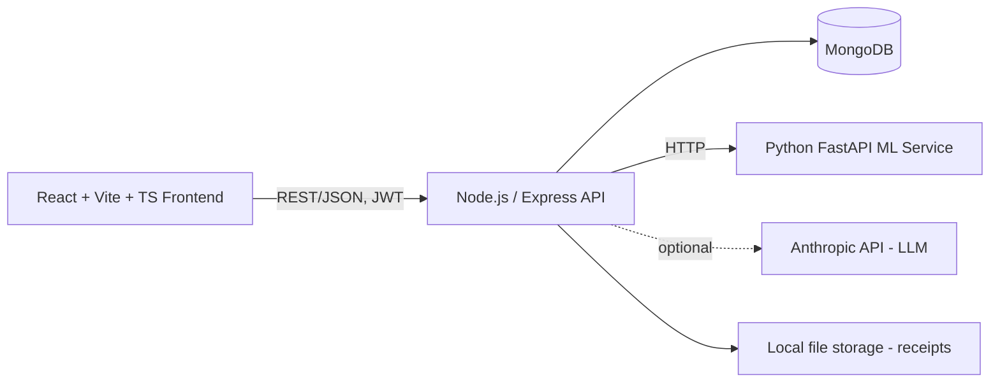

# SpendWise AI

AI-powered personal finance intelligence platform for students and young professionals.

> Understand your spending. Predict your future. Make better financial decisions.

## Progress

All 15 milestones from the original spec are implemented:

- [x] Milestone 1 — Project architecture + authentication
- [x] Milestone 2 — Expense/income management + MongoDB
- [x] Milestone 3 — Dashboard + analytics
- [x] Milestone 4 — Natural-language expense entry
- [x] Milestone 5 — Receipt OCR
- [x] Milestone 6 — Smart categorization
- [x] Milestone 7 — Budgets + recurring expenses
- [x] Milestone 8 — Python ML service
- [x] Milestone 9 — Spending prediction
- [x] Milestone 10 — Anomaly detection
- [x] Milestone 11 — AI insights
- [x] Milestone 12 — AI financial assistant
- [x] Milestone 13 — UI polish (Landing, Onboarding, Settings, all feature pages)
- [x] Milestone 14 — Testing + security
- [x] Milestone 15 — Docker + deployment docs (this file)

## Architecture



Backend layering: `routes -> controllers -> services -> models -> MongoDB`, with cross-cutting middleware for JWT auth, Zod validation, rate limiting, centralized error handling, and Multer file uploads.

## Tech stack

**Frontend:** React 18, Vite, TypeScript, Tailwind CSS, React Router, Axios, React Hook Form + Zod, Recharts, Lucide icons.

**Backend:** Node.js, Express, TypeScript, MongoDB/Mongoose, JWT (access + refresh), bcrypt, Zod, Helmet, CORS, express-rate-limit, Multer, Tesseract.js.

**ML service:** Python 3.12, FastAPI, pandas, NumPy, scikit-learn (linear regression for prediction; median/MAD-based modified z-score and IQR for anomaly detection).

## What each milestone delivers

**1 - Auth:** Register/login/refresh/logout, bcrypt password hashing, short-lived access + long-lived refresh JWTs, Zod-validated inputs, rate-limited auth routes.

**2 - Expenses & income:** Full CRUD with search/filter/sort/pagination. `GET /api/income/summary` computes income, expenses, balance, and savings rate - **deterministically, never via an LLM**.

**3 - Analytics:** Category breakdowns, 6-month income-vs-expense trend, daily spending, month-over-month comparison, top category, biggest transaction - all MongoDB aggregations, all deterministic.

**4 - Natural-language entry:** `POST /api/expenses/parse` turns "Spent Rs450 on Zomato" into structured data. A clean AI-service abstraction: a deterministic offline rule-based extractor by default, or real Claude API calls when configured. LLM output is **always** re-validated through Zod before use - never trusted blindly.

**5 - Receipt OCR:** Upload a receipt image -> Tesseract.js OCR -> a deterministic parser extracts merchant/date/total/line items -> categorized -> review screen before saving. OCR provider is swappable (Tesseract.js by default, Google Vision if configured).

**6 - Smart categorization:** Merchant-category rules learned per-user from corrections, layered over deterministic keyword/merchant-map matching, with "Other" as the safe default.

**7 - Budgets & recurring detection:** Overall or per-category budgets with configurable warning thresholds. Recurring-expense detection is a pure algorithm (interval regularity + amount consistency) - verified not to false-positive on daily habits, irregular visits, or wildly varying amounts.

**8 - Python ML service:** A standalone FastAPI microservice (`ml-service/`) exposing `/predict/monthly-spending` and `/detect/anomalies`.

**9 - Prediction:** Linear regression over monthly history (3+ months) with a confidence interval from residual error; falls back honestly to a moving average with a wider band when there's too little data to regress meaningfully. Never fabricates a confidence score.

**10 - Anomaly detection:** Flags unusual transactions **within their own category**, using a robust median/MAD-based modified z-score rather than a naive mean/std z-score - the naive version was tested and found to let large outliers mask their own detection in small samples; the fix was verified against that exact failure case.

**11 - AI insights:** Facts (top category, month-over-month change, projected spend, budget remaining, savings rate) are computed deterministically first; an LLM (or a template fallback with no LLM configured) only explains those facts in plain English - never invents numbers.

**12 - AI assistant:** Chat interface answers questions like "How much did I spend on food?" by deterministically detecting intent, fetching only the relevant verified data, and generating a grounded answer (AI-phrased or template-based) - the model never sees raw data it wasn't explicitly given.

**13 - UI polish:** Landing page, onboarding flow (income + savings goal setup), full dashboard with nav to every feature, Profile/Settings, loading/empty/error states throughout.

**14 - Testing + security:** 89 backend unit tests + 10 Python pytest tests, all passing (see below for how to run them). Passwords hashed, JWTs scoped correctly, every query scoped to the authenticated user, rate limiting on AI/OCR endpoints, file upload type/size validation, Helmet/CORS configured.

**15 - Docker + deployment:** Docker Compose runs MongoDB, the ML service, the backend, and an Nginx frontend. Only the frontend port is published; MongoDB and internal services stay on the Compose network.

## Live demo

Production deployment: https://spend-wise-ai-tau.vercel.app/

## Setup

### Prerequisites
- Node.js 20+
- Python 3.12+ (for the ML service)
- MongoDB running locally, or a MongoDB Atlas connection string
- (Optional) Docker Compose, if you'd rather run the complete stack in containers

### 1. ML service

```bash
cd ml-service
cp .env.example .env
pip install -r requirements.txt
uvicorn app.main:app --reload --port 8000
```

Runs at `http://localhost:8000`. Health check: `GET http://localhost:8000/health`.

### 2. Backend

```bash
cd backend
cp .env.example .env
# edit .env: Mongo URI, JWT secrets, ML_SERVICE_URL=http://localhost:8000
npm install
npm run dev
```

Runs at `http://localhost:5000`. Health check: `GET http://localhost:5000/health`.

To load demo data (6 months of realistic synthetic transactions, budgets, and a savings goal):

```bash
npm run seed
```

This creates a demo account: `demo@spendwise.ai` / `Demo@1234`. **This is clearly-labeled synthetic data - never real financial data.**

### 3. Frontend

```bash
cd frontend
cp .env.example .env
npm install
npm run dev
```

Runs at `http://localhost:5173`.

### 4. Run the complete stack with Docker Compose

```bash
cp .env.example .env
# Replace the example MongoDB password and both JWT secrets with unique random values.
docker compose up --build -d
```

Open `http://localhost:8080` (or the configured `APP_PORT`). The frontend serves the app and proxies `/api` and `/uploads` to the backend on the private Compose network. MongoDB data and uploaded receipts use named volumes and survive container recreation.

For public deployment, set `PUBLIC_APP_URL` to the final HTTPS origin and place the published frontend port behind a TLS reverse proxy. Generate secrets with a cryptographically secure generator, keep `.env` out of source control, and back up both named volumes. MongoDB credentials should use letters, numbers, underscores, or hyphens so they can be used safely in the internal connection URI. To update an existing deployment, run `docker compose up --build -d`.

## AI & OCR provider configuration

Both the natural-language parser and receipt OCR work **out of the box with no API keys** - they use a deterministic rule-based extractor and Tesseract.js respectively. To use real external providers instead, set in `backend/.env`:

```
AI_PROVIDER=anthropic
AI_API_KEY=sk-ant-...
AI_MODEL=claude-sonnet-4-6

OCR_PROVIDER=google
OCR_API_KEY=your-google-vision-key
```

No code changes needed. Local services read these values from `backend/.env`; Docker Compose reads the provider values from the root `.env`. AI/OCR calls use the configured provider and retain the documented deterministic fallback behavior.

## Running tests

```bash
# Backend - fast, no DB needed (89 tests)
cd backend
npx jest --testPathPattern="unit.test"

# Backend - full integration suite, needs a downloadable mongod binary
npx jest --testPathPattern="integration.test|auth.test"

# ML service (10 tests)
cd ml-service
pip install pytest httpx
python -m pytest tests/ -v
```

## Sample API requests

```bash
# Register & login
curl -X POST http://localhost:5000/api/auth/register -H "Content-Type: application/json" \
  -d '{"name":"Rujuta","email":"rujuta@example.com","password":"StrongPass1"}'

# Natural-language expense entry
curl -X POST http://localhost:5000/api/expenses/parse -H "Content-Type: application/json" \
  -H "Authorization: Bearer TOKEN" -d '{"text":"Spent 450 rupees on Zomato"}'

# Analytics summary
curl http://localhost:5000/api/analytics/summary -H "Authorization: Bearer TOKEN"

# Spending prediction (needs a few months of expense history)
curl http://localhost:5000/api/predictions/monthly -H "Authorization: Bearer TOKEN"

# Anomaly detection
curl http://localhost:5000/api/predictions/anomalies -H "Authorization: Bearer TOKEN"

# AI insight
curl http://localhost:5000/api/insights -H "Authorization: Bearer TOKEN"

# AI assistant
curl -X POST http://localhost:5000/api/assistant/chat -H "Content-Type: application/json" \
  -H "Authorization: Bearer TOKEN" -d '{"question":"What was my biggest expense this month?"}'
```

## API overview

| Area | Endpoints |
|---|---|
| Auth | `POST /api/auth/{register,login,refresh,logout}`, `GET/PUT /api/auth/me` |
| Expenses | `GET/POST /api/expenses`, `GET/PUT/DELETE /api/expenses/:id`, `POST /api/expenses/parse`, `GET /api/expenses/recurring/detect`, `POST /api/expenses/recurring/confirm` |
| Income | `GET/POST /api/income`, `PUT/DELETE /api/income/:id`, `GET /api/income/summary` |
| Analytics | `GET /api/analytics/{summary,categories,trends}` |
| Receipts | `POST /api/receipts/process` (multipart) |
| Budgets | `GET/POST /api/budgets`, `PUT/DELETE /api/budgets/:id` |
| Savings goals | `GET/POST /api/goals`, `PUT/DELETE /api/goals/:id` |
| Predictions | `GET /api/predictions/{monthly,categories,anomalies}` |
| Insights | `GET /api/insights` |
| Assistant | `POST /api/assistant/chat` |

## Database schema (high level)

- **User** - name, email, hashed password, currency, monthlyIncome, savingsGoalAmount
- **Expense** - userId, amount, merchant, category, subcategory, date, paymentMethod, description, receiptUrl, source, aiCategorized, aiConfidence, isRecurring
- **Income** - userId, amount, source, description, date
- **Budget** - userId, category (null = overall), amount, thresholds
- **SavingsGoal** - userId, name, targetAmount, currentAmount, targetDate
- **CategoryRule** - userId, merchantKey, category, timesConfirmed (learned corrections)

## Security

- Passwords bcrypt-hashed (12 rounds), never returned in API responses
- Short-lived access tokens (15m) + separately-signed long-lived refresh tokens (7d)
- Every query scoped to `req.userId` from the JWT - verified with cross-user-isolation tests
- Rate limiting on auth and AI/OCR endpoints
- File upload type (JPEG/PNG/WebP only) and size (5MB) validation
- Helmet, CORS restricted to the configured frontend origin
- `.env.example` files for both services - never commit real secrets

## Limitations

- No password-reset flow yet
- No refresh-token revocation/blacklist (stateless JWT)
- Category-level spend forecasts (Milestone 9) use a simple pace-based projection rather than a full per-category regression - the overall monthly prediction is the one backed by the ML service's linear regression
- The recurring-detection and anomaly-detection algorithms need a handful of transactions per merchant/category before they activate - by design, to avoid guessing from too little data
- Seed script (`npm run seed`) requires a real MongoDB connection; it type-checks cleanly and follows the same patterns as thoroughly-tested code elsewhere in the project, but running it end-to-end needs a live database

## A note on how this was built and tested

Every piece of business logic here - the NL expense parser, the receipt parser, recurring-expense detection, budget math, savings-goal math, month-bucket generation, and the ML service's prediction and anomaly detection - was verified with real unit tests run during development, not just written and assumed correct. The anomaly-detection algorithm specifically went through a real bug-fix cycle: an initial naive mean/std z-score approach was tested against a realistic outlier scenario, found to fail (the outlier masked its own detection), root-caused, fixed with a median/MAD-based approach, and re-verified - that fix and its regression test are both in this repo.

A full MongoDB-backed integration test suite is also included but could not be executed live in the sandbox this was built in (it needs a downloadable `mongod` binary); it will run normally with `npm test` wherever MongoDB is reachable.

## Roadmap / possible extensions

- Password reset flow
- Refresh-token revocation
- Per-category ML-backed forecasts (currently pace-based)
- Push/email notifications for budget threshold crossings and detected anomalies
- Multi-currency support beyond display formatting
- CSV/PDF export of transactions and reports

---

*Demo/seed data is clearly labeled as synthetic and is never presented as real user data.*
